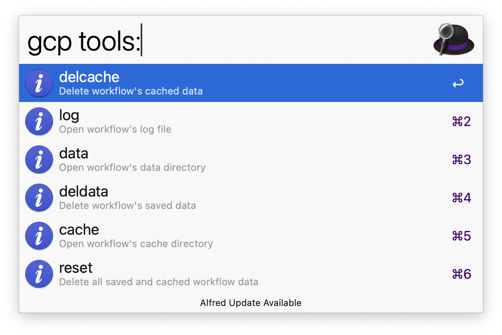

#  alfred-gcp-workflow

An Alfred workflow that lets you instantly open Google Cloud services or search GCP resources—fast, simple, and right from your Alfred.

 
  

## Requirements

- [Alfred 3+](https://www.alfredapp.com/) (with Powerpack)
- [Google Cloud CLI](https://cloud.google.com/sdk/docs/install) installed and authenticated

## Installation

1. Make sure you have the [Google Cloud CLI](https://cloud.google.com/sdk/docs/install) installed and authenticated.
2. Download the latest release from the [releases page](https://github.com/dineshgowda24/alfred-gcp-workflow/releases).
3. Double-click the downloaded `.alfredworkflow` file to install it in Alfred.
4. Follow the instructions in the workflow to set up your gcloud binary path and you are good to go!

> 🆘 **Still stuck?** [Read the full installation guide](INSTALLATION.md) for step-by-step help.

## ✨ Features at a Glance

- 🔍 Fuzzy search across 250+ Google Cloud services and subservices  
- 🔍⚡️ Search live GCP resources across 20+ services, right from Alfred  
- ⚡ Instantly copy, paste or open GCP Console links without touching your browser 
- 🧠 Config and region overrides using simple symbols (`@` and `$`)  
- 🔐 Secure by design, uses your local `gcloud` CLI, never touches credentials  
- 💾 Fast performance with safe caching (customizable via env var)  
- 🛠️ Built-in tools to install new updates, clear cache, view logs, or reset internal data  

## Design Philosophy

1. This workflow never sees your credentials, authentication is handled entirely by the `gcloud` CLI.
2. Only non-sensitive data is cached, such as project names, regions, resource names etc. Jusk enough keep things snappy.
3. Every command fetches only the non sensitive data it needs, keeping it lightweight and efficient.
4. Set your `gcloud` path once, and the workflow runs smoothly without surprises.

> If you notice anything that doesn't align with this, it's unintentional, please open an issue 🙏

## Usage

1. Open Alfred and type `gcp` to see the available services and commands.
2. The home page will display useful links to Google Cloud:  
     
   _Example: Home screen with quick links to GCP Console, Health Status, tools etc._
3. Type `gcp` followed by a service name.  
   _Example: `gcp comp` will fuzzy-match and show services like Compute Engine._
4. If a service has 🗂️ in its subtitle, <kbd>Tab</kbd> to autocomplete into the subservices section.
5. You can filter subservices directly by typing their name.  
   _Example: Typing `gcp compute inst` will fuzzy-match and show subservices like instances for Compute Engine._
6. If a subservice has 🔍⚡️ in its subtitle, it supports **resource search**.  
   _Example: after typing `gcp compute`, <kbd>Tab</kbd> into `instances` to list all instances in your project._
   [See full list of searchable resources.](#️-supported-resource-searches)
7. The workflow uses your currently active gcloud configuration by default.  
   To override it, type `@` in your query to list and <kbd>Tab</kbd> to select the desired configuration.
8. To override specific region, type `$` in your query to list and <kbd>Tab</kbd> to select the desired region.

---

### ⚠️ Heads up about regions

- Not all services support all regions. The workflow checks if the selected region is supported by the searcher **before** calling `gcloud`, so you'll get immediate feedback instead of a failure.
- Some resources are **global**, meaning they aren't tied to a region or zone. Selecting a region won't affect those results.

**Examples of global resources:**
- Compute snapshots  
- Compute instance templates  
- Pub/Sub topics and subscriptions  
_This is not an exhaustive list: if changing the region has no effect, the resource is likely global._

### Advanced Usage

1. Type `gcp tools:` to list the maintenance options powered by [AwGo Magic Actions](https://pkg.go.dev/github.com/deanishe/awgo#MagicAction).You can use <kbd>Tab</kbd> to navigate between actions like clearing the cache, viewing logs, or resetting internal data folders, then press <kbd>Enter</kbd> to run the selected action.  
    
   _Example: Maintenance tools screen with options like clear cache and view logs._  
2. The workflow supports [Fuzzy Filtering](https://pkg.go.dev/github.com/deanishe/awgo/fuzzy), so you can quickly find services or resources, even with partial or out-of-order matches.
3. By default, resource searches are cached for 7 days. To customize this duration, set the `ALFRED_GCP_WORKFLOW_CACHE_TTL_SECONDS` environment variable in Alfred. Learn how to do this here: [Alfred Environment Variables Guide](https://www.alfredapp.com/help/workflows/advanced/variables/#environment).

## 🔍⚡️ Supported Resource Searches

Here are the GCP resources currently searchable through the workflow:

| Service | Resource |
|---------|----------|
| 🛢️ Cloud SQL | Instances |
| 🧠 Memorystore | Redis Instances |
| 📬 Pub/Sub | Topics, Subscriptions |
| 📦 Storage | Buckets |
| 🖥️ Compute Engine | Instances, Disks, Images, Instance Templates, Machine Images, Snapshots |
| ☸️ Kubernetes Engine (GKE) | Clusters |
| 🗄️ Filestore | Instances |
| 🌐 Cloud DNS (Network Services) | DNS Zones |
| 🛤️ VPC | Networks, Routes |
| 🔐 Network Connectivity | VPN Tunnel, VPN Gateway, Cloud Router |
| 🗃️ Artifact Registry | Repositories |
| 🏃‍♂️ Cloud Run | Functions (Gen1), Services (Gen2) |
| 📋 Cloud Tasks | Queues |

## Contributing

Please refer to the [contributing guidelines](CONTRIBUTING.md) for instructions on setting up your environment and submitting contributions.

## License

This project is licensed under the MIT License. See the [LICENSE](LICENSE) file for full license information.

## Donate ♥️

If this workflow saved you time or made your day a little easier, consider showing some support:

## 🙏 Acknowledgements

This workflow is inspired by the amazing [aws-alfred-workflow](https://github.com/rkoval/alfred-aws-console-services-workflow).
As a past user of that workflow before switching to GCP, I wanted to create a similar experience for GCP users.
Huge thanks to the original author for the idea and inspiration,  without which this workflow wouldn't exist!